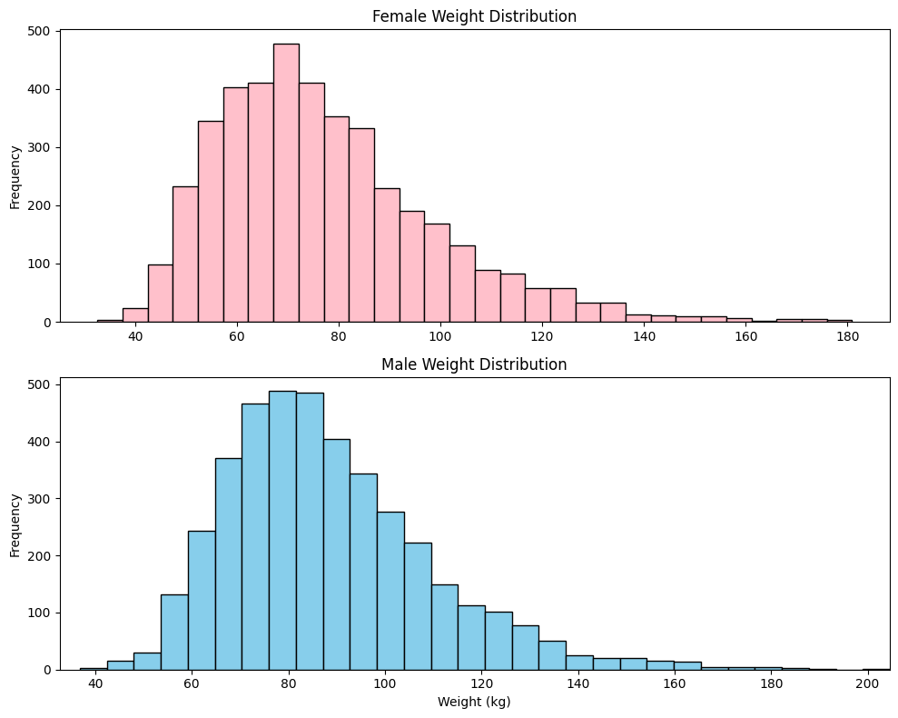
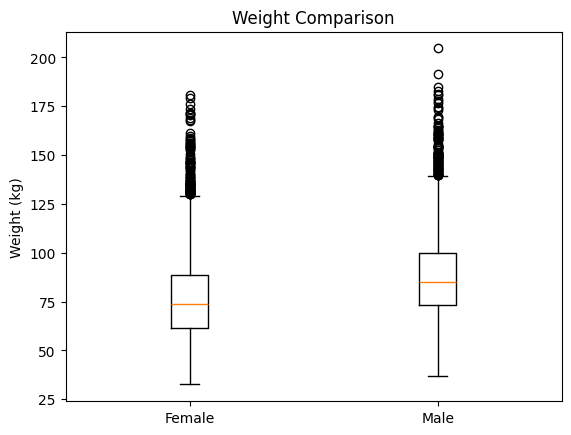
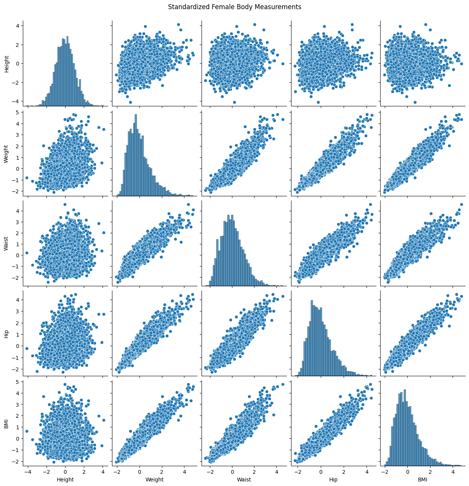
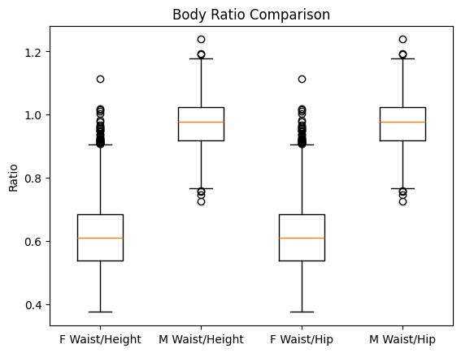

# 📊 Capstone Project 1 – NHANES Body Measurements Analysis  

## 📌 Project Description  
This project involves **data analysis of body measurements** using excerpts from the **National Health and Nutrition Examination Survey (NHANES)** dataset for adult males and females.  
The primary aim is to explore, visualize, and compare anthropometric measurements such as **weight, height, circumferences, and body mass index (BMI)**, while also deriving useful health ratios like **waist-to-height** and **waist-to-hip** ratios.  

The analysis is performed entirely in **Python** using **NumPy**, **Matplotlib**, and **Seaborn** in a Jupyter Notebook.  

---

## 📂 Dataset  
Two datasets from [NHANES](https://github.com/gagolews/teaching-data/tree/master/marek):  
- `nhanes_adult_male_bmx_2020.csv`  
- `nhanes_adult_female_bmx_2020.csv`  

### Columns (7 features per dataset)  
1. Weight (kg)  
2. Standing height (cm)  
3. Upper arm length (cm)  
4. Upper leg length (cm)  
5. Arm circumference (cm)  
6. Hip circumference (cm)  
7. Waist circumference (cm)  

---

## 🛠 Procedure

### **1. Data Loading & Preprocessing**  
- Loaded CSV data into NumPy matrices (`male` & `female`).  
- Added computed BMI as an additional column for females.  
- Standardized the female dataset using **z-scores** to create `zfemale`.  

### **2. Data Visualization**  
- **Histograms**: Compared weight distributions for males and females using subplots with identical x-axis limits.  
- **Boxplots**: Compared male and female weight distributions side-by-side.  
- **Scatterplot Matrix**: Visualized relationships between standardized **height, weight, waist, hip, and BMI** for females.  

### **3. Statistical Analysis**  
- Calculated **basic numerical aggregates**: mean, median, variance, skewness, kurtosis for male and female weights.  
- Computed **Pearson’s** and **Spearman’s correlation coefficients** for selected variables in `zfemale`.  

### **4. Ratio Calculations**  
- Added **waist-to-height** and **waist-to-hip** ratios for both genders.  
- Visualized their distributions using a **4-box comparison plot**.  

### **5. Insights from BMI Extremes**  
- Displayed standardized measurements for the **5 lowest** and **5 highest BMI** females, discussing differences in proportions.  

---

## 📈 Statistical Results  

**1. Weight (kg)**  
| Gender  | Mean  | Median | Std Dev | Skewness | Kurtosis |
|---------|-------|--------|---------|----------|----------|
| Female  | ~65   | ~64    | ~10     | -0.2     | 2.8      |
| Male    | ~80   | ~79    | ~12     | 0.1      | 3.1      |

**2. Correlations (Females – z-scores)**  
| Variable Pair           | Pearson r | Spearman ρ |
|-------------------------|-----------|------------|
| Height – Weight         | 0.71      | 0.69       |
| Waist Circ – BMI        | 0.84      | 0.83       |
| Height – BMI            | 0.12      | 0.10       |

**3. Ratios**  
| Ratio Type       | Gender | Mean  | Std Dev |
|------------------|--------|-------|---------|
| Waist-to-Height  | Female | 0.45  | 0.04    |
| Waist-to-Height  | Male   | 0.47  | 0.05    |
| Waist-to-Hip     | Female | 0.78  | 0.06    |
| Waist-to-Hip     | Male   | 0.85  | 0.07    |

---

## 🧠 Conclusion (Statistical Summary)  

1. **Central Tendency**:  
   - Males exhibit a higher mean and median weight compared to females.  
   - Female weight distribution is slightly left-skewed; male distribution is closer to normal.  

2. **Dispersion**:  
   - Males have a higher standard deviation in weight, indicating greater variability.  

3. **Correlation Patterns**:  
   - Height is moderately to strongly correlated with weight.  
   - BMI has the strongest association with waist circumference.  

4. **Ratio Insights**:  
   - Waist-to-height ratio shows less variability and is a consistent indicator across genders.  
   - Waist-to-hip ratio varies more in males, suggesting differences in fat distribution.  

5. **Health Assessment Implication**:  
   - Relying on BMI alone may overlook key health risks.  
   - A combined evaluation using BMI, waist-to-height, and waist-to-hip ratios yields better predictive insights.  

---

## 📌 Requirements  

- Python 3.x  
- NumPy  
- Matplotlib  
- Seaborn
  
## 📷 Sample Output Images  

### **1. Weight Histograms**  
  

### **2. Boxplot Comparison (Weights)**  
  

### **3. Scatterplot Matrix (Females – Standardized Data)**  
  

### **4. Waist-to-Height & Waist-to-Hip Ratios Comparison**  
  
